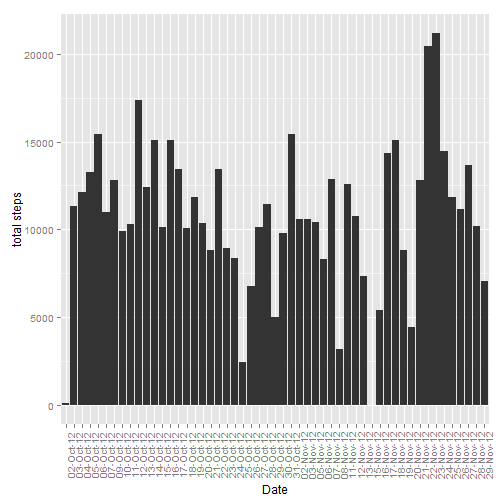
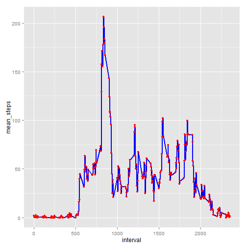
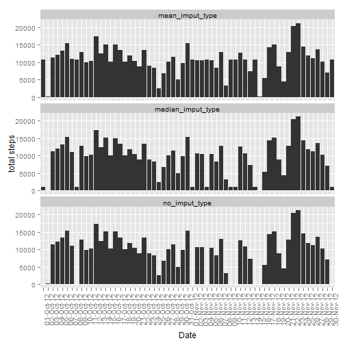
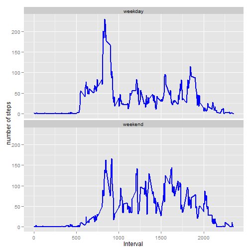

Loading and preprocessing the data for Reproducable Research - Assignment#1
Data read from the file: activity.csv and date field is assigned date class for easier date operations. Also, data table is ordered and cached to improve performance


```r
library(lubridate)
library(data.table)

##dataset read into data.table

unzip("activity.zip")
f <- as.data.table(read.csv("activity.csv",header=TRUE))

##Full Dataset including NA
f$date <- ymd(f$date)
setkey(f,date)

##Dataset without NA
f_no_na <- subset(f,!is.na(f$steps))
setkey(f_no_na,date)
```

Two functions are created for re-usability of aggregate operations .


```r
####################################################################
## agg_func function take four arguments
## f - dataset used in aggregation. columns name:steps
##     is mandatory required.
## agg_fld_nm : field name used in aggregate in group by clause
## agg_type : type of aggregate. eg. sum, mean, median etc
## rslt_fld_nm : aggregate result field name
##
## agg_func return data.table with two fields agg_fld_nm,rslt_fld_nm
####################################################################
agg_func <- function(f = data.table(),agg_fld_nm="",agg_type="",rslt_fld_nm=""){
        
        ##Generate Aggregate value.
        s <- as.data.table(aggregate(f$steps, by=list(with(f,get(agg_fld_nm))), FUN=agg_type))
        ##Assign Field Names.
        setnames(s,c(agg_fld_nm,rslt_fld_nm))
        ##Assign key & re-order
        setkeyv(s,agg_fld_nm)
        
        ##print data.table
        s
        
}

##################################################################
## imputing_func function take 2 arguments
## f - dataset used in aggregation. columns names:steps,
##     date,interval are mandatory required.
## func_name : aggregate function name
##
## Description: imputing_func return data table with same set of fields
## as provided in input dataset(f).However, f$steps will be filled with 
## imputed values. 
## imputing approach: If f$steps = NA, check if day-wise mean
## can be used. otherwise, check min-wise mean value for imputing.
##################################################################

imputing_func <- function(f = data.table(),func_name=""){
        
        f_no_na <- subset(f,!is.na(f$steps))
        
        #Day wise mean of steps
        s_daywise_mean <- agg_func(f_no_na,"date",func_name,"mean_date_steps")

        #Interval wise mean of steps accross days.        
        s_minwise_mean <- agg_func(f_no_na,"interval",func_name,"mean_min_steps")
        
        #Merge main data set with date wise mean & interval wise mean
        f_merge <- merge(s_daywise_mean,f,by.x="date",by.y="date",all = TRUE)
        f_merge_all <- as.data.table(merge(f_merge,s_minwise_mean,by="interval",all = TRUE))
        f_merge_all$date <- ymd(f_merge_all$date)
        setkey(f_merge_all,date)        
        
        ##If steps has NA, check if daywise mean has value.
        ##if daywise mean has NA, check if min wise mean has value.
        f_merge_all$steps <- ifelse(!is.na(f_merge_all$steps),
                                    f_merge_all$steps,
                                    ifelse(!is.na(f_merge_all$mean_date_steps),
                                           f_merge_all$mean_date_steps,
                                           f_merge_all$mean_min_steps
                                          )
                                    )
        ##select only columns steps,date,interval
        subset(f_merge_all,select=c(names(f)))
              
}
```


Below are the results based on questions in assignment task

Task#1: What is mean total number of steps taken per day?
---------------------------------------------------------
1. Make a histogram of the total number of steps taken each day
2. Calculate and report the mean and median total number of steps taken per day


```r
library(lubridate)
library(data.table)
library(ggplot2)

##getting 
s_sum <- agg_func(f_no_na,"date","sum","total_steps")

s_sum$date <- ymd(s_sum$date)

s_sum$date_as_factor <- factor(format(s_sum$date,"%d-%b-%y"), 
                        levels = format(s_sum$date,"%d-%b-%y"), 
                        ordered = TRUE)

ggplot(s_sum,aes(x=date_as_factor,y=total_steps))+
        geom_bar(stat="identity")+
        labs(y="total steps")+ 
        labs(x="Date")+
        opts(axis.text.x = theme_text(angle=90))
```

```
## 'opts' is deprecated. Use 'theme' instead. (Deprecated; last used in version 0.9.1)
## theme_text is deprecated. Use 'element_text' instead. (Deprecated; last used in version 0.9.1)
```

 


```r
##Calculate mean and median of steps
s_mean <- agg_func(f_no_na,"date","mean","mean_steps")
s_median <- agg_func(f_no_na,"date","median","median_steps")
```


Display mean of steps 

```r
head(s_mean)
```

```
##          date mean_steps
## 1: 2012-10-02     0.4375
## 2: 2012-10-03    39.4167
## 3: 2012-10-04    42.0694
## 4: 2012-10-05    46.1597
## 5: 2012-10-06    53.5417
## 6: 2012-10-07    38.2465
```

Display median of steps


```r
head(s_median)
```

```
##          date median_steps
## 1: 2012-10-02            0
## 2: 2012-10-03            0
## 3: 2012-10-04            0
## 4: 2012-10-05            0
## 5: 2012-10-06            0
## 6: 2012-10-07            0
```

Task#2: What is the average daily activity pattern?
---------------------------------------------------
 1. Make a time series plot (i.e. type = "l") of the 5-minute interval (x-axis) and the average number of steps taken, averaged across all days (y-axis)

 2.Which 5-minute interval, on average across all the days in the dataset, contains the maximum number of steps?
 

```r
#Calculate minute wise mean

s_min_mean <- agg_func(f_no_na,"interval","mean","mean_steps")
```

time series plot


```r
ggplot( data = s_min_mean, aes(x=interval,y=mean_steps)) + 
        geom_line(size=1,colour="blue") + 
        geom_point(size=2,colour="red")
```

 

Time interval having max number of average steps.

```r
##Time interval having max number of average steps.
s_min_mean[mean_steps == max(s_min_mean$mean_steps),]
```

```
##    interval mean_steps
## 1:      835      206.2
```


Task#3 Imputing missing values
-------------------------------
Note that there are a number of days/intervals where there are missing values (coded as NA). The presence of missing days may introduce bias into some calculations or summaries of the data
1.Calculate and report the total number of missing values in the dataset (i.e. the total number of rows with NAs)
2.Devise a strategy for filling in all of the missing values in the dataset. The strategy does not need to be sophisticated. For example, you could use the mean/median for that day, or the mean for that 5-minute interval, etc.
3. Create a new dataset that is equal to the original dataset but with the missing data filled in.
4.Make a histogram of the total number of steps taken each day and Calculate and report the mean and median total number of steps taken per day. Do these values differ from the estimates from the first part of the assignment? What is the impact of imputing missing data on the estimates of the total daily number of steps?


Total number rows with missing values

```r
nrow(subset(f,is.na(f$steps)))
```

```
## [1] 2304
```

Data preparation based on imputing as requested in Point#2 & #3 


```r
##Imput mean of (steps by day) or (by interval)
s_mean_imput <- imputing_func(f,"mean")
##Calculate sum of steps per day after mean imputing.
s_mean_imput_sum <- agg_func(s_mean_imput,"date","sum","total_steps")
##Making sure date is of class date
s_mean_imput_sum$date <- ymd(s_mean_imput_sum$date)
##Adding new field to store date as factor for displaying histogram in 
##sorted order by date
s_mean_imput_sum$date_as_factor <- factor(format(s_mean_imput_sum$date,"%d-%b-%y"), 
                        levels = format(s_mean_imput_sum$date,"%d-%b-%y"), 
                        ordered = TRUE)
##column: typ is used for histogram's facet call
s_mean_imput_sum$typ <- rep(c("mean_imput_type"),nrow(s_mean_imput_sum))


##Imput median of (steps by day) or (by interval)
s_median_imput <- imputing_func(f,"median")
##Calculate sum of steps per day after imputing.
s_median_imput_sum <- agg_func(s_median_imput,"date","sum","total_steps")
##Making sure date is of class date
s_median_imput_sum$date <- ymd(s_median_imput_sum$date)
##Adding new field to store date as factor for displaying histogram in 
##sorted order by date
s_median_imput_sum$date_as_factor <- factor(format(s_median_imput_sum$date,"%d-%b-%y"), 
                        levels = format(s_median_imput_sum$date,"%d-%b-%y"), 
                        ordered = TRUE)
##column: typ is used for histogram's facet call
s_median_imput_sum$typ <- rep(c("median_imput_type"),nrow(s_median_imput_sum))


##Sum of steps without imput add column: typ to be in consistent with above data.tables
##column: typ is used for histogram's facet call
s_sum$typ <- rep(c("no_imput_type"),nrow(s_sum))
s_sum$total_steps <- as.numeric(s_sum$total_steps)

##rbind all data.tables(s_mean_imput_sum, s_median_imput_sum,s_sum)
s_total <- rbind(s_mean_imput_sum,s_median_imput_sum,s_sum)
```

Sample records after imputing mean and median.


```r
head(s_sum)
```

```
##          date total_steps date_as_factor           typ
## 1: 2012-10-02         126      02-Oct-12 no_imput_type
## 2: 2012-10-03       11352      03-Oct-12 no_imput_type
## 3: 2012-10-04       12116      04-Oct-12 no_imput_type
## 4: 2012-10-05       13294      05-Oct-12 no_imput_type
## 5: 2012-10-06       15420      06-Oct-12 no_imput_type
## 6: 2012-10-07       11015      07-Oct-12 no_imput_type
```

```r
head(s_median_imput_sum)
```

```
##          date total_steps date_as_factor               typ
## 1: 2012-10-01        1141      01-Oct-12 median_imput_type
## 2: 2012-10-02         126      02-Oct-12 median_imput_type
## 3: 2012-10-03       11352      03-Oct-12 median_imput_type
## 4: 2012-10-04       12116      04-Oct-12 median_imput_type
## 5: 2012-10-05       13294      05-Oct-12 median_imput_type
## 6: 2012-10-06       15420      06-Oct-12 median_imput_type
```

```r
head(s_mean_imput_sum)
```

```
##          date total_steps date_as_factor             typ
## 1: 2012-10-01       10766      01-Oct-12 mean_imput_type
## 2: 2012-10-02         126      02-Oct-12 mean_imput_type
## 3: 2012-10-03       11352      03-Oct-12 mean_imput_type
## 4: 2012-10-04       12116      04-Oct-12 mean_imput_type
## 5: 2012-10-05       13294      05-Oct-12 mean_imput_type
## 6: 2012-10-06       15420      06-Oct-12 mean_imput_type
```

Histogram does dataset imputed with mean values look consistant.


```r
library(data.table)
library(ggplot2)


ggplot(s_total,aes(x=date_as_factor,y=total_steps))+
        geom_bar(stat="identity")+
        labs(y="total steps")+ 
        labs(x="Date")+
        opts(axis.text.x = theme_text(angle=90))+
        facet_wrap(~typ,nrow=3)
```

```
## 'opts' is deprecated. Use 'theme' instead. (Deprecated; last used in version 0.9.1)
## theme_text is deprecated. Use 'element_text' instead. (Deprecated; last used in version 0.9.1)
```

 

Task#4 Are there differences in activity patterns between weekdays and weekends?
---------------------------------------------------------------------------------
For this part the weekdays() function may be of some help here. Use the dataset with the filled-in missing values for this part.
1.Create a new factor variable in the dataset with two levels - "weekday" and "weekend" indicating whether a given date is a weekday or weekend day.

2.Make a panel plot containing a time series plot (i.e. type = "l") of the 5-minute interval (x-axis) and the average number of steps taken, averaged across all weekday days or weekend days (y-axis). The plot should look something like the following, which was creating using simulated data:

Seperating data set by Weekdays and Weekends as per Point#1


```r
s_mean_imput_min <- imputing_func(f,"mean")
s_mean_imput_min$day_type <- ifelse(weekdays(s_mean_imput_min$date,abbreviate=TRUE) == "Sun" | 
                                    weekdays(s_mean_imput_min$date,abbreviate=TRUE) == "Sat"
                                    ,"weekend",
                                    "weekday")

s_mean_imput_min_sum <- as.data.table(
                        aggregate(s_mean_imput_min$steps, 
                        by=list(interval=s_mean_imput_min$interval,
                                day_type=s_mean_imput_min$day_type), 
                        FUN=mean))

setnames(s_mean_imput_min_sum,c("interval","day_type","mean_steps"))
```

Panel plot for average number of steps for 5 minute intervals


```r
library(data.table)
library(ggplot2)

ggplot(s_mean_imput_min_sum,aes(x=interval,y=mean_steps))+
        geom_line(type="1",colour="blue",size=1)+
        labs(y="number of steps")+ 
        labs(x="Interval")+
        facet_wrap(~day_type,nrow=2)
```

 


